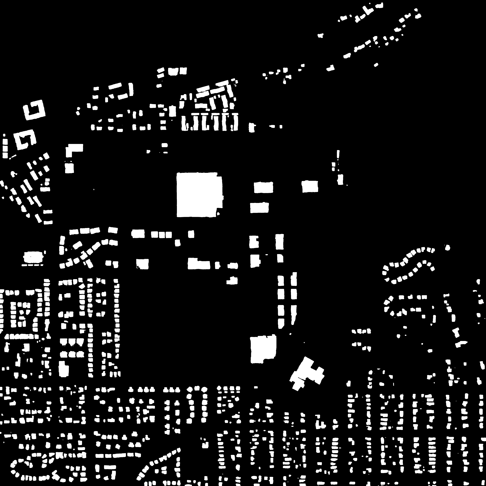

# Cегментация спутниковых снимков

Сервис осуществляет сегментацию спутниковых снимков и предоставляет REST API
для пользования.
Пример:

<p align="center"> Исходное изображение </p>


<p align="center"> Тепловая карта уверенности модели (logit + sigmoid) </p>


<p align="center"> Сегментационная маска (t=0.5) </p>


<p align="center"> Исходное изображение + маска </p>

# Деплой

Чтобы запустить сервис, склонируйте репозиторий.
Cоздайте yaml-конфиг по примеру (находится в репозитории):
host, port отвечают за параметры uvicorn-сервера
```yaml
app:
  host: 0.0.0.0
  port: 8000
  keep_alive: 60

models:
  unet_fp16:
    input_size: 384
    batch_size: 20
    tile_res: 512
    to_resize: 384
    overlap: 0.2
    norm_mean: [0.4014, 0.4235, 0.3888]
    norm_std: [0.1708, 0.1555, 0.1457]

inference:
  execution_providers: ['CUDAExecutionProvider','CPUExecutionProvider']
  enable_fallback: True
```

Для config.yaml и для каждой модели из *config:models* нужно определить переменную окружения с адресом .onnx файла в разделе *environment*. Этот путь должен вести к mounted volume из раздела *volumes*, в которых находятся модели и config.yaml.
**Обратите внимание**, что название переменной окружения должно полностью совпадать с названием раздела config:models для конкретной модели (без учёта регистра). Пример: env=UNET_FP16 -> model=unet_fp16.

```yaml
services:
  api:
    ports:
      - "8000:8000"
    build: .
    volumes:
      - ./config.yaml:/mnt/configs/config.yaml
      - ../models/production:/mnt/models
    runtime: nvidia
    environment:
      - API_CONFIG=/mnt/configs/config.yaml
      - UNET_FP16=/mnt/models/Unet_1.0_fp16.onnx
    deploy:
      resources:
        limits:
          memory: 8G
          cpus: '6'
        reservations:
          devices:
            - driver: nvidia
              count: 1
              capabilities: [gpu]
```

**Модели можно найти по адресу**: [text](https://drive.google.com/drive/folders/1WOoWfOzWk4i5dRhIm1OgfetGBQxVKbog?usp=sharing)

Запуск сервисов:
```
docker-compose up -d
```

# Использование
API можно запустить из Swagger: ``` http://127.0.0.1:8000/docs ```

Или пользоваться  cURL:
```bash
curl -X 'POST' \
  'http://127.0.0.1:8000/segment_buildings' \
  -H 'accept: application/json' \
  -H 'Content-Type: multipart/form-data' \
  -F 'file=@photo_2025-09-03_19-18-22.jpg;type=image/jpeg' \
  -F 'model=unet_fp16' \
  -F 'format_as=.png' \
  -F 'threshold=0.5' \
  -F 'get_overlayed=true' \
  -F 'as_json=false' \
  -F 'filename=test' \
  \ -o test.zip
```
См. Swagger docs для документации параметров запроса.
